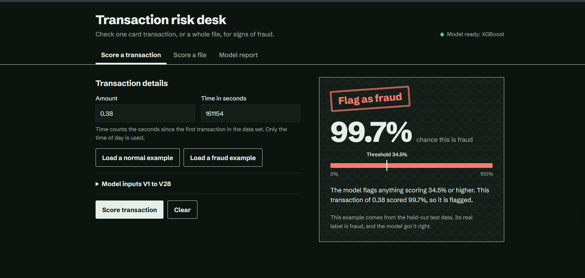
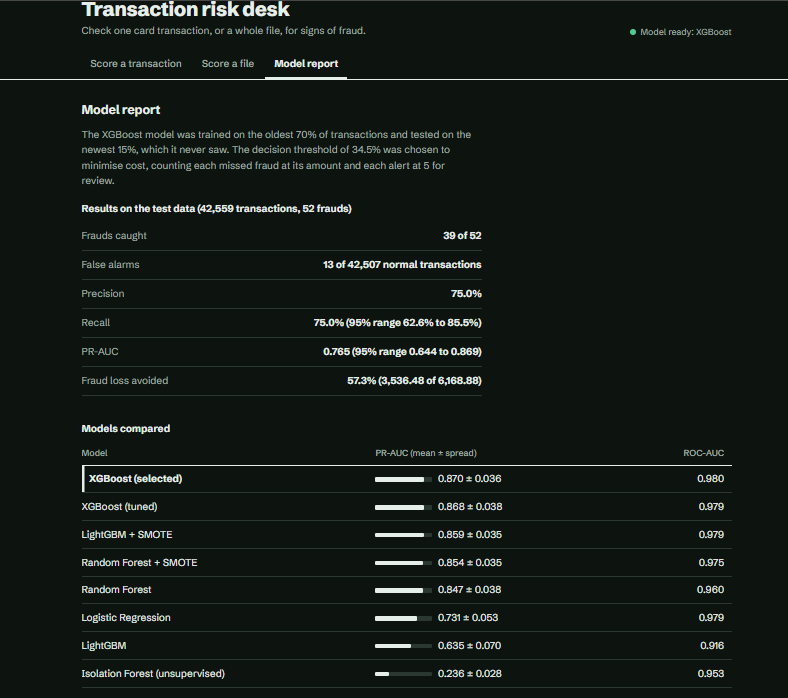

# Credit Card Fraud Detection

[](https://github.com/siddhantkyama/credit-card-fraud-detection/actions/workflows/ci.yml)

**Live demo:** https://credit-card-fraud-detection-euko.onrender.com  
(free hosting; the app sleeps after 15 minutes of inactivity, so the first open can take up to a minute)

An end-to-end fraud detection system: seven models compared with leakage-free validation, a cost-based decision threshold, a FastAPI service, and a web dashboard for scoring single transactions or whole files.



## Problem

Fraud is rare (0.17% of transactions in this data set), so accuracy is meaningless: a model that approves everything scores 99.8%. This project optimises what matters to a bank: catching fraud while keeping false alarms and review effort low.

## Approach

| Step | What was done | Why |
|---|---|---|
| Data | Removed 1,081 duplicate rows (19 of them frauds) | Duplicates can appear in both train and test and inflate scores |
| Split | Oldest 70% train, next 15% validation, newest 15% test | A deployed model scores future transactions, so the test set must come later in time |
| Features | Log-scaled `Amount`; time of day (sin/cos) instead of raw `Time` | Raw elapsed seconds does not generalise |
| Models | Logistic Regression, Random Forest, Random Forest + SMOTE, XGBoost, LightGBM, LightGBM + SMOTE, Isolation Forest | A baseline, the classic approach, gradient boosting and an unsupervised method |
| Imbalance | Class weights compared with SMOTE, with SMOTE inside the CV pipeline | SMOTE must only touch training folds |
| Validation | 5-fold stratified cross-validation scored by PR-AUC | PR-AUC suits rare events; ROC-AUC looks flattering |
| Tuning | Optuna (25 trials) on the best boosting model | Search instead of guessing |
| Threshold | Chosen on the validation set to minimise business cost | The default 0.5 is rarely the cheapest |
| Reporting | Test set used once, with bootstrap confidence intervals | Only 52 frauds in the test set, so single numbers are noisy |

## Results

**Model comparison** (5-fold CV on the training data, PR-AUC, higher is better)

| Model | PR-AUC (mean ± sd) |
|---|---|
| **XGBoost (selected)** | **0.870 ± 0.036** |
| XGBoost (Optuna-tuned) | 0.868 ± 0.038 |
| LightGBM + SMOTE | 0.859 ± 0.035 |
| Random Forest + SMOTE | 0.854 ± 0.035 |
| Random Forest | 0.847 ± 0.038 |
| Logistic Regression | 0.731 ± 0.053 |
| LightGBM (class weights) | 0.635 ± 0.070 |
| Isolation Forest (unsupervised) | 0.236 ± 0.028 |

**Test set** (newest 15% of transactions: 42,559 rows, 52 frauds; decision threshold 0.345)

| Metric | Value |
|---|---|
| Frauds caught | 39 of 52 |
| False alarms | 13 out of 42,507 normal transactions |
| Precision / Recall | 75.0% / 75.0% |
| PR-AUC | 0.765 (95% range 0.644 to 0.869) |
| ROC-AUC | 0.978 |
| Simulated fraud loss | 2,632 with the model vs 6,169 with none (57% avoided) |



**How to read this**

- The four best models are within one standard deviation of each other, so XGBoost is the pick on the mean, not a clear winner.
- Tuning did not improve on the default XGBoost settings (0.868 vs 0.870), so the defaults were kept.
- Test PR-AUC is lower than the CV figure because CV shuffles transactions from the same period while the test set is the future.
- The cost saving is simulated: each missed fraud costs its amount and each alert costs 5 to review.

## Limitations and open questions

- Features V1 to V28 are anonymised, so the model cannot be explained in business terms.
- The data covers two days in 2013, so drift over months cannot be studied.
- The test set has only 52 frauds, so all results carry wide confidence ranges.
- LightGBM with class weights scored far below LightGBM with SMOTE (0.635 vs 0.859). I suspect over-weighting the fraud class, but I have not investigated it.
- The review cost of 5 per alert is an assumption, not a measured figure.

## Run it

```bash
python -m venv venv
venv\Scripts\activate            # Windows   (macOS/Linux: source venv/bin/activate)
pip install -r requirements-dev.txt

# download creditcard.csv into data/  (see data/README.md)

python -m src.train --tune       # trains, compares, tunes, saves model + plots
uvicorn api.main:app --reload    # then open http://127.0.0.1:8000
pytest                           # run the tests
```

`python -m src.train --fast` is a quick check of the code only; its numbers are not reportable.

The trained model (`models/fraud_model.joblib`) is committed on purpose, so the app and the Docker image run without the 150 MB data set. Re-train and commit it whenever the modelling code changes.

### With Docker

```bash
docker build -t fraud-api .
docker run -p 8000:8000 fraud-api     # then open http://127.0.0.1:8000
```

The image installs from `requirements-serve.txt`, which pins the exact library versions the model was trained with (`python scripts/pin_serving_versions.py` regenerates it). A pickled model is only reliable with the versions that created it, so the API logs a warning and CI fails if they ever differ.

### Without the Kaggle data

```bash
python scripts/make_synthetic_data.py --out data/synthetic.csv
python -m src.train --fast --data data/synthetic.csv
```

This creates a small fake data set with the same columns so you can try the whole pipeline. Its numbers mean nothing. CI uses it to test every push.

## Project structure

```
src/features.py    feature engineering, shared by training and the API
src/data.py        loading, de-duplication, time-based split
src/models.py      the models being compared
src/evaluate.py    PR-AUC, cost-based threshold, confidence intervals, plots
src/train.py       the training pipeline
api/main.py        FastAPI service; also serves the frontend
frontend/          index.html (plain HTML, CSS and JavaScript, no build step)
tests/             pytest tests
scripts/           synthetic data generator, version-pinning helper
Dockerfile         container image for the API and dashboard
.github/workflows/ci.yml   tests plus a Docker build and smoke test on every push
docs/              screenshots used in this README
models/  outputs/  generated by training
```

## API

| Endpoint | Purpose |
|---|---|
| `POST /predict` | One transaction (Time, V1..V28, Amount) returns probability, decision and risk level |
| `POST /predict-batch` | CSV upload returns a summary and the 100 highest-risk rows |
| `GET /model-info` | Training results shown in the Model report tab |
| `GET /health` | Liveness check |
| `GET /docs` | Interactive API documentation |

## Next steps

Public deployment, MLflow experiment tracking, drift monitoring with Evidently, and a second data set with raw features (merchant, location) for velocity-style feature engineering.
